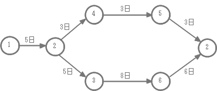

# Infomation Processing Ⅰ期末試験

1. 「売上」、「費用」、「利益」の関係を式で表して下さい  

1. PPMの４つの要素で、「金のなる木」、「花型商品」以外の２つを書きなさい  

1. 「データマイニング」とは何ですか説明して下さい  

1. 機能要件と非機能要件の違いを説明して下さい  

1. ホワイトボックステストとブラックボックステストの違いを説明して下さい  

1. 以下のアローダイアグラム(パート図)の作業は少なくとも何日かかりますか  
 またクリティカルパスを示して下さい

	

1. なぜ内部統制において職務分掌が重要なのですか説明して下さい  

1. 以下の(1)~(7)のカッコを埋めて下さい  
	- バイトの補助記憶単位(接頭辞)  
		- 1 (1) バイト = 1024バイト  
		- 1 (2) バイト = 1024 (1) バイト  
		- 1 (3) バイト = 1024 (2) バイト  
		- 1 (4) バイト　= 1024 (3) バイト  
	- 秒の補助記憶単位(接頭辞)  
		- 1 (5) 秒 = 0.001秒  
		- 1 (6)秒 = 0.001 (5) 秒  
		- 1 (7) 秒 = 0.001 (6) 秒  

1. 以下の２進数を１０進数および１６進数に変換して下さい
	1. 11011000  

	1. 11001100  
	
	1. 110010  
	
	1. 1101  
	
	1. 1110  

1. RAMの種類でSRAMとDRAMの違いを説明して下さい

1. 信頼性向上を目的としたシステム構成で、デュプレックスシステムとデュアルシステム  
の違いを説明して下さい

1. 図1のように稼働率0.9の装置Aを2台並列に接続し，稼働率0.8の装置Bを  
その後に直列に接続したシステムがある。このシステムを図2のように装置Aを1台にした  
場合，システムの稼働率は図1に比べて幾ら低下するか。  
ここで，図1の装置Aはどちらか一方が稼働していれば正常稼働とみなす。

	

1. 9けたの数字に対して，次のルールでチェックディジットを最後尾に付けることにした。  
チェックディジットを付加した10けたの数字として，正しいものはどれか。  
ルール1:  
各けたの数字を合計する。  
ルール2:  
ルール1で得られた数が2けたになった場合には，  
得られた数の各けたの数字を合計する。  
この操作を，得られた数が1けたになるまで繰り返す。  
ルール3:  
最終的に得られた1けたの数をチェックディジットとする。  
	1. 1234567890
	1. 4444444444
	1. 5544332211
	1. 6655333331  

1. リレーショナルデータベース(RDB)において「主キー(プライマリキー)」の目的について  
説明して下さい  

1. 無線LANの規格であるIEEE802.11a/b/g/nについてそれぞれの速度(理論値)  
と周波数帯を説明して下さい  

1. グローバルIPアドレスとプライベートIPアドレスを変換する技術である「IPマスカレード(NAPT)」  
について説明して下さい  

1. 技術的な脅威の「ランサムウェア」とは何ですか説明して下さい

1. SWOT分析について説明して下さい

1. 1～4の番号をもつ四つの状態がある。四つの状態は図のようにつながれており，  
時計回りや反時計回りに状態を選移することができる．  

	

	現在，状態1にいて，次の手順を2回実施した後はどの状態にいるか．  
	 
	〔手順〕  
	今いる状態の番号を11倍し，それを3で割った余りによって次の処理を行う．  
	- 余りが0の場合：時計回りに一つ次の状態に遷移する．
	- 余りが1の場合：反時計回りに一つ次の状態に選移する．
	- 余りが2の場合：時計回りに二つ次の状態に選移する．

1. 「電子透かし」とは何ですか説明して下さい

1. グラフィックソフトウェアについて、「ドロー系」と「ペイント系」の違いを説明して下さい

1. 商品表(products)から価格(price)が100円以上の行を全て抽出する  
select文を書いて下さい

1. データベースにおけるトランザクション制御とは何ですか説明して下さい

1. LANとWANの違いを説明して下さい

1. 公開鍵基盤における「認証局」の役割は何ですか説明して下さい