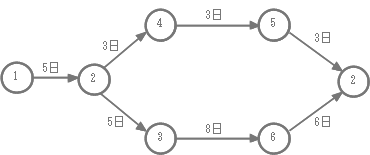

# 小テスト

## 10/22

1. メモリの種類でROMとRAMの違いを説明して下さい
1. RAMの種類でSRAMとDRAMの違いを説明して下さい
1. パソコンとディスプレイの間のインタフェースで、アナログRGBとHDMIの違いを  
説明して下さい  
1. システムの処理形態の集中処理(一つのコンピュータで全ての処理を実行)  
と分散処理(クライアント・サーバ型やピアツーピア型)の処理の違いを長所/短所  
の観点で説明して下さい  
1. 信頼性向上を目的としたシステム構成で、デュプレックスシステムとデュアルシステム  
の違いを説明して下さい

## 10/21

1. 以下の２進数を１０進数および１６進数に変換して下さい
	1. 11011000  
	8+16+64+128 => 216  
	13,8 => D8  
	1. 11001100  
	4+8+64+128 => 204  
	12, 12 => CC
	1. 110010  
	2+16+32 => 50  
	3, 2 => 32  
	1. 1101  
	1+4+8 => 13  
	13 => D  
	1. 1110  
	2+4+8 => 14  
	14 => E  

## 10/15

1. ４個から２個を取り出す組み合わせは幾つあるか  
6通り  
1. 以下の(1)~(7)のカッコを埋めて下さい  
	- バイトの補助記憶単位(接頭辞)  
		- 1 (1) バイト = 1024バイト  
		- 1 (2) バイト = 1024 (1) バイト  
		- 1 (3) バイト = 1024 (2) バイト  
		- 1 (4) バイト　= 1024 (3) バイト  
	- 秒の補助記憶単位(接頭辞)  
		- 1 (5) 秒 = 0.001秒  
		- 1 (6)秒 = 0.001 (5) 秒  
		- 1 (7) 秒 = 0.001 (6) 秒  
		(1)k (2)M (3)G (4)T (5)m (6)μ (7)n  
1. データ操作方法の「スタック」と「キュー」の違いを説明して下さい  
スタック => 後入れ先出し、キュー => 先入れ先だし  
1. 音声、画像、動画データなどを一定の規則に基いてディジタルデータ  
へ変換することや、文字を２進数で表現することを何といいますか  
符号化  
1. CGI(Common Gateway Interface)とは何ですか  
Webサーバの拡張機能で、通常Webブラウザで処理するものをWebサーバ側で  
処理して結果のみをブラウザに送信する仕組み  

## 10/14

1. ベストプラクティスとは何ですか説明して下さい  
様々な手法の中から選ばれた実績のある最善の事例  
1. SLAとは何ですか説明して下さい  
ITサービスを提供する業者が保証する品質の範囲をあらかじめユーザに提示し、  
合意した内容のこと  
1. サービス・サポートの種類で、インシデント管理と問題管理の違いは何ですか  
説明して下さい  
インシデント管理 => 緊急対応、問題管理 => 原因を突き止めて、恒久的な対策  
1. サージ防護とは何ですか説明して下さい  
落雷などによるサージ電流からIT機器を守ること  
1. なぜ内部統制において職務分掌が重要なのですか説明して下さい  
担当者と承認者で権限を分離することにより、チェックのプロセスを増やし、不正やミスを  
防ぐことができるため  

## 10/13

1. プロジェクトとは何ですか説明して下さい  
ある目標のために期間や予算を決めてチームを構成し、活動すること  
1. プロジェクトが目標を達成するために重要な３つの要素とは何ですか説明して下さい  
品質、費用、納期  
1. WBS(Work Breakdown Structure)とは何ですか説明して下さい  
作業を具体的かつ詳細に分解し、必要な作業を階層的に明らかにすること  
1. 以下のアローダイアグラム(パート図)の作業は少なくとも何日かかりますか  
 またクリティカルパスを図示して下さい

	

24日、① -> ② -> ③ -> ⑥ -> ②

## 10/8

1. 機能要件と非機能要件の違いを説明して下さい  
機能要件はソフトウェアが実現すべき動作や処理、非機能要件は  
機能要件以外でソフトウェアが満たさなければならない性能やセキュリティ対策等  
1. 外部設計と内部設計の違いを説明して下さい  
外部設計やUIなどユーザからの見えの部分の設計、内部設計はプログラムの構造など  
開発者からしか見えない部分の設計  
1. ホワイトボックステストとブラックボックステストの違いを説明して下さい  
ホワイトボックステストはプログラムの構造からテスト項目を洗い出す  
ブラックボックステストはプログラムの機能仕様/インタフェースからテスト項目を洗い出す  
1. ファンクションポイント法による見積もりはどのように行われますか  
ソフトウェア開発の開発対象となる機能のうち、外部入力、外部出力、外部参照、  
外部インタフェースファイル、内部論理ファイルの五つの要素に着目し、これらの要素に対して  
数とそれぞれの重み、それにシステム特性を乗じて開発規模を算出  
1. 「プロトタイピングモデル」とはどのような開発モデルですか  
プロトタイプ(試作品)をはじめに施策し、ユーザの要求を確認する．その内容をもとに実際の開発  
を行っていく手法．  

## 10/7

1. 「E-R図(Entity-Relationship Diagram)」は何に利用されるか  
業務プロセスの現状把握．データ間の静的な関係を図示  
1. 「DFD(Data Flow Diagram)」は何に利用されるか  
業務プロセスの現状把握．データの流れとプロセスの流れを図示  
1. 「ハウジングサービス」とは何か  
企業が所有するハードウェアをネットワークや空調設備が整った施設に設置する  
サービス  
1. 「データマイニング」とは何か  
蓄積された大量のデータから統計的手法を用いて、今まで認識されていなかった  
規則性や関係性を導き出すこと  
1. 「提案依頼書(RFP)」の目的は何か  
依頼元企業がベンダ企業に対して、提案書及び見積書の提供を依頼するため  
依頼元企業はベンダから提供された提案書及び見積書を検討し、依頼先ベンダ企業  
を選定する  

## 10/6

1. PPMの４つの要素で、「金のなる木」、「花型商品」以外の２つを書きなさい  
問題児、負け犬  
1. 「TOB」とはなにか？  
株式公開買い付け（Take Over Bid）：買い付け価格と期間を公表して  
不特定多数の株主から株式を買い集めること
1. 「BTO」とはなにか？  
商品を部品の形で在庫しておき、顧客から注文が入ったタイミングで注文に応じた  
商品を組み立てる生産方法．Build To Orderの略
1. 「CRM」とはなにか？  
顧客関係管理(Customer Relationship Management)．顧客に関する情報を  
一元管理する手法で、顧客とのやり取りを含めて管理する．顧客との関係を強化し、  
企業収益の向上に結ぶ  
1. 「コンカレントエンジニアリング」とはなにか？  
設計途中のデータを購買・生産・検査部門などの後工程と共有することにより、設計段階で  
フィードバックをかけることができ、開発期間を短縮できる  

## 10/1

1. 「プロジェクト組織」とはなにか？  
プロジェクトの目標を達成するために、必要な技術や経験の  
保有者を各部署から選抜して適宜構成する組織  
1. 「OJT」とはなにか？  
上司や先輩が業務を遺書に行いながら注意点やノウハウを伝授する  
1. 「パレート図」はどのような目的に使用されるか？  
多いものが何パーセントを占めるかの分析でABC分析でも利用  
1. 「特性要因図」はどのような目的に使用されるか？  
真の原因の分析  
1. 「売上」、「費用」、「利益」の関係を式で表して下さい  
利益 = 売上 - 費用